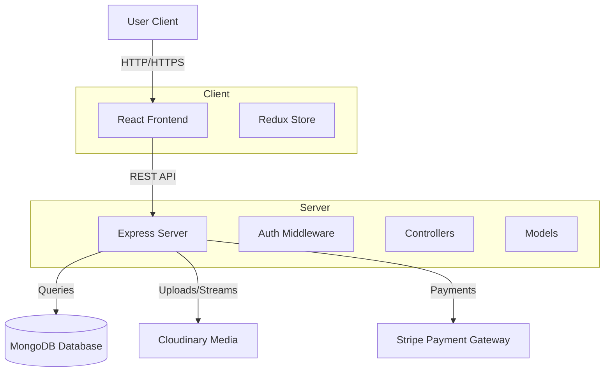
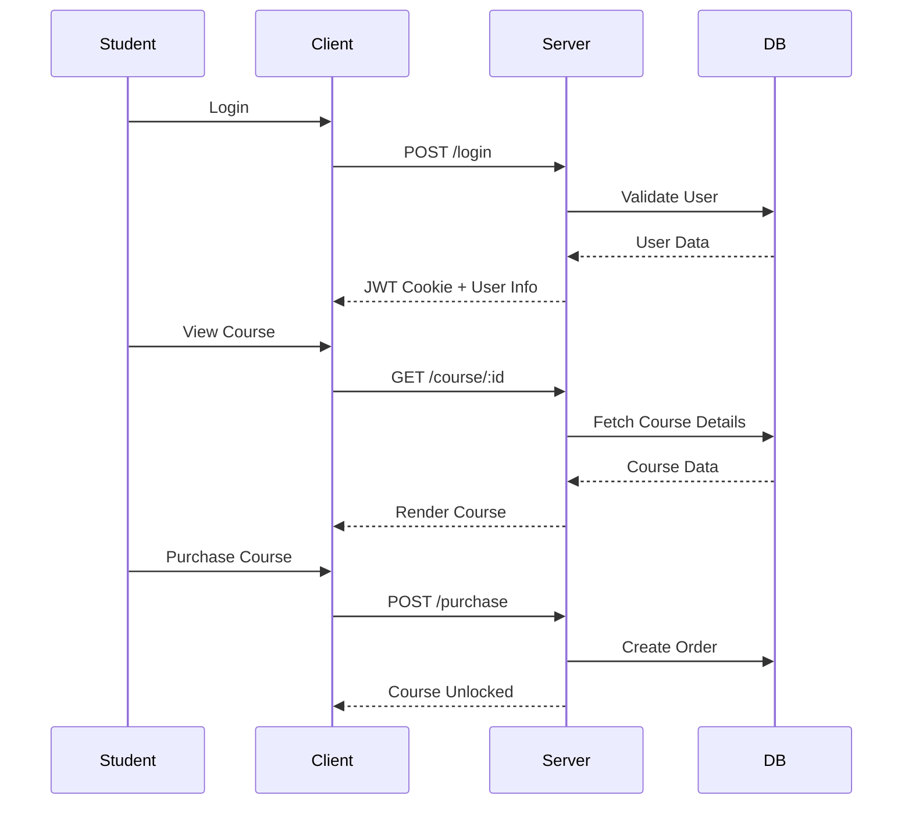
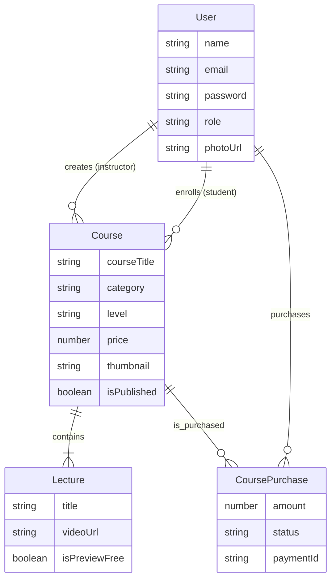

# 🎓 E-Learning Platform

> A full-stack Learning Management System (LMS) built with the MERN stack, enabling instructors to create courses and students to enroll and learn.


## 🚀 Overview

This comprehensive E-Learning Platform provides a seamless experience for both students and instructors. It features robust authentication, course management, video streaming, progress tracking, and secure payments. Designed with a modern, responsive UI using React and Tailwind CSS.

## ✨ Key Features

### 👨‍🎓 For Students
- **Course Discovery**: Browse and search for courses by category and level.
- **My Learning**: Track enrolled courses and progress.
- **Video Player**: High-quality video playback for lectures.
- **Progress Tracking**: innovative progress bars and completion status.
- **Secure Payments**: Integrated Stripe payment gateway for purchasing courses.
- **Profile Management**: Update personal details and profile picture.

### 👩‍🏫 For Instructors (Admin)
- **Dashboard**: Analytics on course sales and student enrollment.
- **Course Management**: Create, edit, and publish new courses.
- **Lecture Management**: Add video lectures, descriptions, and free previews.
- **Rich Text Editor**: Format course descriptions beautifully.

### 🛠 General
- **Authentication**: Secure login/signup with JWT and HTTP-only cookies.
- **Dark Mode**: Fully supported dark/light theme switching.
- **Responsive Design**: Optimized for mobile, tablet, and desktop.

## 🏗 Technology Stack

### Frontend
- **Framework**: [React](https://react.dev/) (Vite)
- **Styling**: [Tailwind CSS](https://tailwindcss.com/)
- **UI Components**: [Shadcn UI](https://ui.shadcn.com/) (Radix UI) + Lucide React Icons
- **State Management**: [Redux Toolkit](https://redux-toolkit.js.org/)
- **Routing**: [React Router DOM](https://reactrouter.com/)
- **Form/Data**: Axios, React Hook Form (implied)
- **Media**: React Player

### Backend
- **Runtime**: [Node.js](https://nodejs.org/)
- **Framework**: [Express.js](https://expressjs.com/)
- **Database**: [MongoDB](https://www.mongodb.com/) (Mongoose)
- **Authentication**: JSON Web Tokens (JWT), Bcrypt.js
- **Media Storage**: [Cloudinary](https://cloudinary.com/)
- **Payments**: [Stripe](https://stripe.com/)

## 🏛 Architecture

### System Overview



### User Flow



## 🗄 Database Schema

The application uses a relational-style schema within MongoDB using References.



## 📸 Screen Sheets (Screenshots)

> **Note**: Add your actual application screenshots in the folders below and update the paths.

### Student Portal
| **Home Page** | **Course Detail** |
|:---:|:---:|
|  |  |
| *Browse courses and categories* | *View course content and enroll* |

### Learning Experience
| **Video Player** | **My Learning** |
|:---:|:---:|
|  |  |
| *Watch lectures with progress tracking* | *Manage your enrolled courses* |

### Instructor Dashboard
| **Admin Dashboard** | **Create Course** |
|:---:|:---:|
|  |  |
| *View sales and enrollment stats* | *Builder interface for new courses* |

## 🛠 Installation & Setup

### Prerequisites
- Node.js (v14+)
- MongoDB (Local or Atlas)
- Cloudinary Account
- Stripe Account

### 1. Clone the Repository
```bash
git clone https://github.com/Wakjira-Tesama/E-Learning-.git
cd E-Learning-
```

### 2. Backend Setup
```bash
cd server
npm install
```
Create a `.env` file in the `server` directory:
```env
PORT=8080
MONGO_URI=your_mongodb_connection_string
SECRET_KEY=your_jwt_secret
CLOUDINARY_CLOUD_NAME=your_cloud_name
CLOUDINARY_API_KEY=your_api_key
CLOUDINARY_API_SECRET=your_api_secret
STRIPE_SECRET_KEY=your_stripe_secret_key
FRONTEND_URL=http://localhost:5173
```
Start the server:
```bash
npm run dev
```

### 3. Frontend Setup
```bash
cd ../client
npm install
```
Start the client:
```bash
npm run dev
```

---
Made with ❤️ by [Wakjira Tesama](https://github.com/Wakjira-Tesama)
